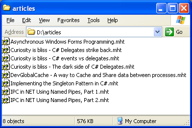
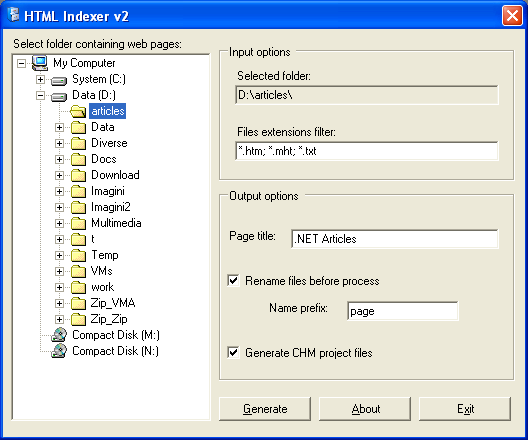
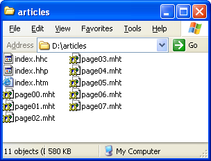
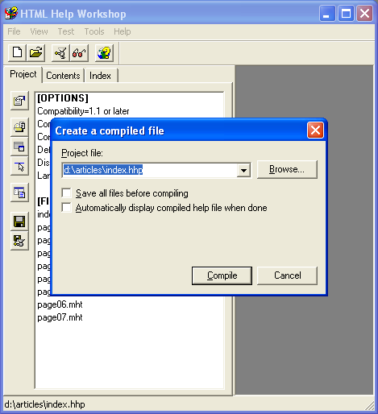
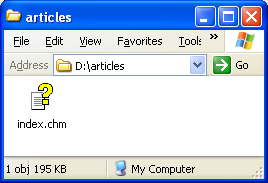
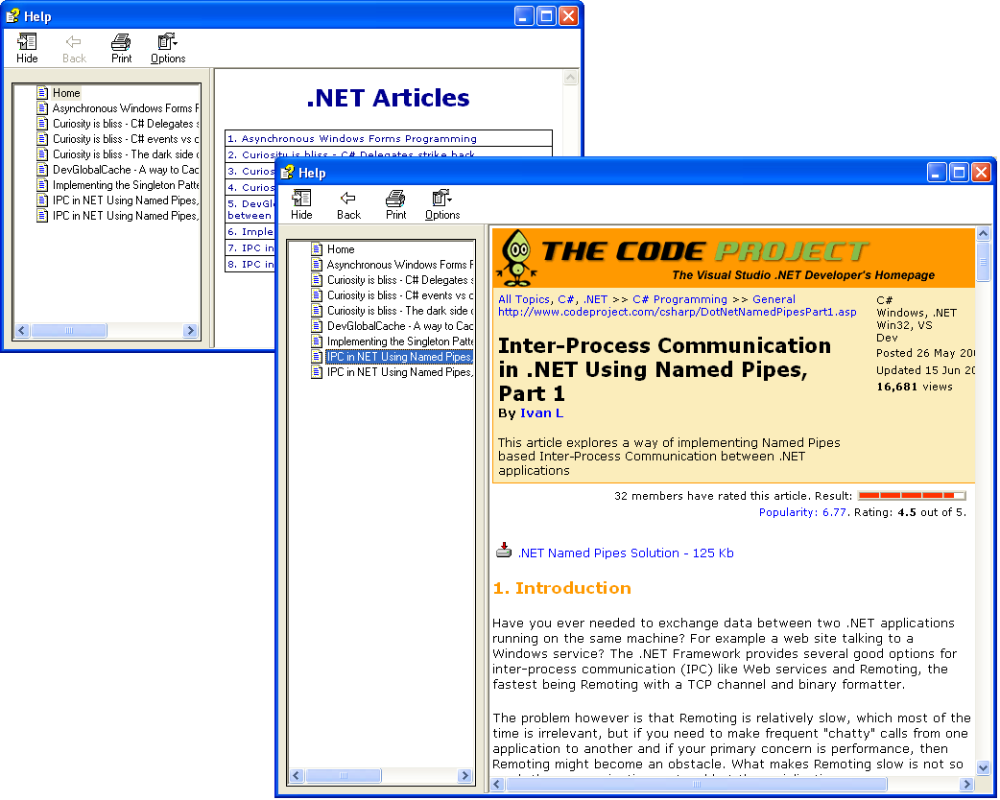

# HTMLIndexer

Last update: 2002

Archive saved HTML pages in CHM files

A few years ago the Internet access was so slow that people often saved interesting web pages to local drive for easy and quick reference. Some pages were sent to the printer but most of them remained stored on computer hard drive. Even with today’s high speed internet people still saves web pages to their computer for different reasons. Collecting and availability (in case the online page is removed) are some of them. For archiving purpose most users are making a zip file out of their folders and burn the file to a CD or DVD. To view an archived article you have to unzip the entire collection first. Due to this inconvenience most articles are never reopened and become lost forever inside that zip file. A better approach is to make a CHM (Compressed HTML Manual) file out of an entire folder of saved web pages. While a CHM has roughly the same size of a zip file it retains the ability to open the entire archive without requiring prior file extraction or other preparation. The CHM format was invented by Microsoft to keep Windows manuals in a modern and compact format.

Step 1. Save your favorite pages
--------------------------------

Because I like compact things I’m usually using the MHT format when I’m saving a web page from Internet Explorer. If you didn’t know about this, next time when you’ll save a page, it will be a good opportunity to test it.

If your saved pages are not in MHT format there is no reason to worry - the solution presented here works with almost any web document: MHT, HTML, etc.

Step 2. Start HTMLIndexer application
-------------------------------------

HTMLIndexer can be used mainly for 2 purposes: to generate an Index page for all articles in a folder, or to help generating a CHM file out of all articles in a folder. Since the scope of this post is to show you how to archive an entire folder of articles in a single CHM file make sure you check “Generate CHM project file” checkbox. A good idea is to check also the “Rename files” checkbox to increase compatibility with CHM specification.

After HTMLIndexer finishes its job take a look in your folder and note that several files appeared there: index.htm, index.hhp, index.hhc. If you checked “Rename files” then the filenames are also renamed using shorter names.

Step 3. Compile the CHM file
----------------------------

For this step you’ll need a second free application: Microsoft HTML Help Workshop. If you are a developer the chances are that you already have this application. If you don’ have it you can download it for free from Microsoft site.

Don’t worry about how to use it. Just install it and then double click on index.hhp file generated at previous step. Next press compile button and wait for application to finish its job.

Step 4. Cleaning up
-------------------

That’s all. Now you can delete all the other files in the folder and keep only the generated CHM file.

You may now burn the CHM file on a CD, send it by email to a friend or just store it to your local hard drive. In any case you’ll be amazed how that huge folder of HTML files turned out in a nicely formatted CHM file in less than 2 minutes.

